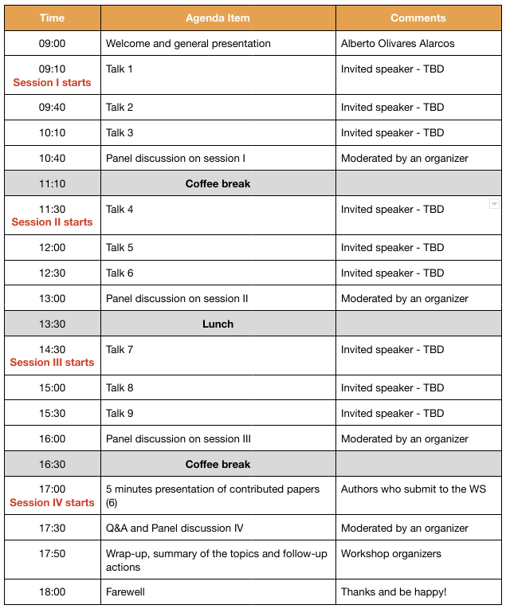

**Location:** Pacific Convention Plaza, Yokohama, Japan

**Invited speakers (alphabetical order)**

- Stephen Balakirsky, Georgia Tech Research Institute (GTRI), USA [**accepted**]
- Michael Beetz, Institute for Artificial Intelligence, University of Bremen, Germany [pending]
- Koji Kamei, NTT Communication Science Laboratories, Japan [**accepted**]
- Riichiro Mizoguchi, Japan Advanced Institute of Science and Technology, Japan [**accepted**]
- Alessandro Umbrico, Institute of Cognitive Sciences and Technologies (ISTC-CNR), Italy [**accepted**]
- Alessandro Saffiotti, University of Örebro, Sweden [pending]
- Elisa Tosello, Embedded Systems Unit, Fondazione Bruno Kessler, Italy [**accepted**]
- Megan Zimmerman, National Institute of Standards and Technology (NIST), USA [**accepted**]

<!--
**Tentative agenda**

-->
